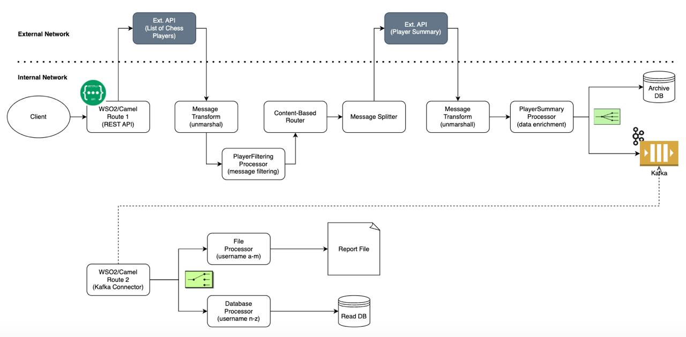

# Apache Camel vs WSO2 Micro Integrator POC

This Proof of Concept (POC) aims to perform a comparison and benchmarking between Apache Camel and WSO2 Micro Integrator platforms based on the same scenario. The POC simulates several enterprise integration patterns and includes connectors for database, message-oriented middleware, and HTTP.

## Technologies Used

- **Java Version**: 17
- **Apache Camel Version**: 4.9.0
- **Spring Boot Version**: 3+
- **WSO2 Micro Integrator Version**: 4.3.0
- **Kaoto**: 2.4.0
- **Camel JBang**: 0.122.0

## Enterprise Integration Patterns

The POC simulates the following enterprise integration patterns:

1. **Message Transformation**: Transforming messages from one format to another.
2. **Content-Based Router**: Routing messages to different endpoints based on their content.
3. **Message Splitter**: Splitting a composite message into individual messages.
4. **Pipes and Filtering**: Filtering messages based on certain criteria.
5. **Multicast Endpoint**: Sending messages to multiple endpoints simultaneously.

## Connectors

The POC includes the following connectors:

- **Database**: PostgreSQL
- **Message-Oriented Middleware (MoM)**: Kafka
- **HTTP**: RESTful API
- **File**: File Connector

